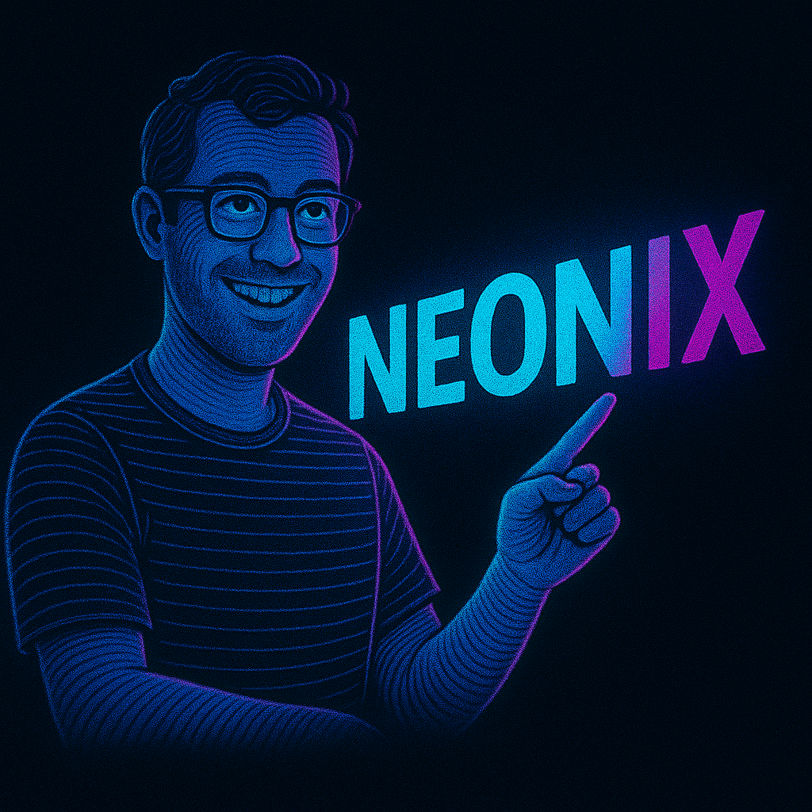

  

<i>"I build on what others have built — so that the next can build higher."</i>

---

---

## 👋 About Me

I'm Nicola Montanari — a self-taught developer passionate about automation, trading systems and applied machine learning.  
I build open tools to explore the intersection of trading platforms and intelligent software architecture.

---

## 🧠 Neo Quantower Toolkit

This repository acts as the central hub for a modular suite of tools that extend the **Quantower** trading platform through **Reinforcement Learning (RL)** and automation.

🔹 Technologies: C#, Python, TensorFlow, Streamlit, SQLite  
🔹 Style: Modular, event-driven, developer-friendly  
🔹 Goal: Build, learn, test, and share better infrastructure for algorithmic trading

---

## 🔗 Related Repositories

| Project | Description |
|--------|-------------|
| [`Neo.Quantower.Toolkit`]([[https://github.com/neonic/neo-quantower-toolkit](https://github.com/Nico88-Vs/NeoQuantowerTools.git)]) | Core framework for modular plugin development in C# |
| [`Strategy Manager`](https://github.com/neonic/strategy-manager) | Component for managing trading strategies, SL/TP and metrics |
| [`RL.Training.Core`](https://github.com/neonic/rl-training-core) | Python backend for training reinforcement learning agents |
| [`RL.Training.UI`](https://github.com/neonic/rl-training-ui) | Streamlit UI to configure and monitor training sessions |
| [`RL.Quantower.UIBridge`](https://github.com/neonic/rl-quantower-uibridge) | Experimental plugin to control RL agents directly in Quantower |

---

## 📈 Project Status

🛠 Work in progress  
🚀 Open to collaboration  
🔗 All modules actively evolving

---

## 🗂 GitHub Project Board

Use the [Project Board](https://github.com/users/Nico88-Vs/projects/4) to follow feature planning, task status and roadmap.

---

## 📫 Contact

- Email: [nicoladotmontanari@yahoo.com](mailto:nicoladotmontanari@yahoo.com)

---

> Thanks for checking out my work. Feel free to fork, explore or get in touch.
